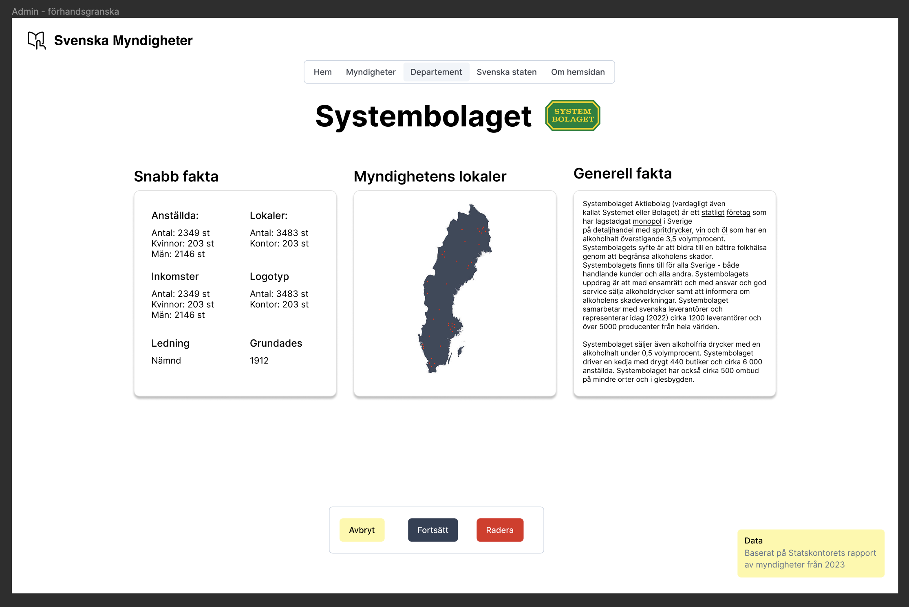

# TDDD27_2024

This is the README file for our project idea for the course TDDD27 - 2024.

Participants:  

Filip Hamrelius - Filha243  
Anna Granberg - Anngr950  

filha243@student.liu.se 
anngr950@student.liu.se  

## Project idea

Our idea is to map Swedish authorities, fundamentally it's a search engine with an admin page. The following pages are planned to be implemented:

- Homepage with menu and search function
- Authority page with advanced filters and search function
    - Subpage for each authority, presenting logo, facts, potentially a map with all their locations.
    - Subpage with a regular list of all authorities
- Department page: Show how all authorities are subordinate to different departments, some kind of graph - node link diagram.

- Admin login homepage
- Authority editing page
- Preview of adding an authority

Authority = Myndighet 
Department = Departement (Svenska) 

## Tech stack

Programming language: Javascript & Typescript  
Framework: Next.js (Typescript) 
Autentication backend: nextAuth.js 
Database backend: MongoDB  

## Data

The data will be collected by ourselfs from "Regerings Kansliet" and "statskontoret". We are aware that the extra work on the data does not affect the project scope. 

## Project idea - Design mockup

